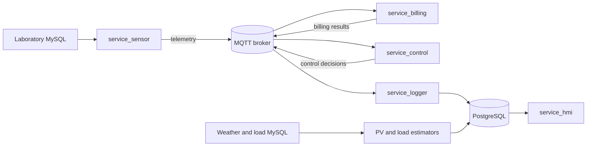

# Microgrid PLTS

Microgrid PLTS is a monitoring and analysis system for a solar photovoltaic (PV) microgrid. It combines PV, battery energy storage system (BESS), utility grid, and load telemetry; calculates economic metrics; applies a rule-based decision support system (DSS); estimates daily PV generation and demand; and presents the results through a web-based human-machine interface (HMI).

The stack uses Python, MQTT, PostgreSQL, Flask, TensorFlow, and Docker Compose.

## System Overview



Each service has its own directory, dependencies, and process. `docker-compose.yml` runs them together as one stack. See [Architecture](docs/architecture.md) for the complete data flow.

## Quick Start

Requirements:

- Docker Engine or Docker Desktop with Docker Compose v2.
- Network access to the laboratory MySQL databases.
- Read-only credentials for the source databases.

Create a local environment file on Windows PowerShell:

```powershell
Copy-Item .env.example .env
```

Set the MySQL credentials and replace every `change-me` value in `.env`, then run:

```bash
docker compose config --quiet
docker compose up --build -d
docker compose ps
```

Open <http://localhost:5000>.

> **Important:** Compose provides the local MQTT broker and PostgreSQL database, but telemetry, weather, and load source data remain in external laboratory MySQL databases. The dashboard can start without those sources, but it will not display current operational data.

For configuration details and startup checks, see [Getting Started](docs/getting-started.md).

## Services

| Service | Responsibility |
|---|---|
| `service_sensor` | Combines fresh, synchronized data from the source MySQL databases |
| `service_logger` | Creates the runtime schema and stores MQTT events |
| `service_billing` | Calculates renewable fraction, cost, LCOE, ESSA, and CO2 metrics |
| `service_control` | Selects an operating status using rule-based EMS logic |
| `service_estimation_pv` | Estimates hourly PV production for the current day |
| `service_estimation_load` | Estimates minute-level demand for the current day |
| `service_pemantauan` | Validates ranges, freshness, frozen values, and timestamp order |
| `service_hmi` | Serves the Flask dashboard and HTTP API |
| `service_watchdog` | Reports data freshness and performs limited HMI recovery |

## Documentation

- [Documentation Home](docs/index.md)
- [Architecture](docs/architecture.md)
- [Getting Started](docs/getting-started.md)
- [Services](docs/services.md)
- [Data Contracts](docs/data-contracts.md)
- [Estimation Models](docs/estimation-models.md)
- [Operations and Troubleshooting](docs/operations.md)

## Local Validation

Run the repository's minimum checks after Python or Compose changes:

```bash
python -m compileall -q service_sensor service_logger service_billing service_control service_pemantauan service_watchdog service_hmi_flask pv_service_estimation load_service_estimation
python -m unittest discover -s tests -v
docker compose config --quiet
```

These checks validate Python syntax, regression tests, and the resolved Compose configuration. A complete runtime check also requires an active Docker Engine and access to the laboratory network.
