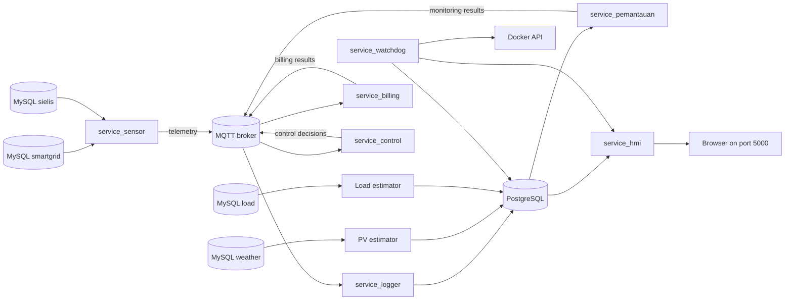

# Architecture

## System Structure

This repository uses a microservice architecture. Each service directory has a distinct dependency set and lifecycle and is not intended to be merged into a single process. `docker-compose.yml` integrates the services through the `microgrid_net` bridge network, MQTT, PostgreSQL, and shared data contracts.

## Main Data Flow

1. `service_sensor/kirim.py` reads the latest hybrid inverter, PV inverter, and load meter records from MySQL.
2. The sensor rejects missing, stale, future-dated, or poorly synchronized source records. For an accepted snapshot, it creates a deterministic `telemetry_id` and publishes one payload every 60 seconds.
3. `service_billing` and `service_control` consume telemetry and publish their respective results.
4. `service_logger` consumes telemetry, billing, control, and monitoring messages and writes them to PostgreSQL.
5. `service_pemantauan` reads recent sensor rows from PostgreSQL and publishes data-quality results.
6. The PV and load estimators write daily prediction batches directly to PostgreSQL.
7. The Flask HMI reads PostgreSQL and serves the dashboard and API.
8. `service_watchdog` reports table freshness. It restarts only the HMI when readiness fails, subject to a cooldown and restart budget.

## System Boundary

Compose provides:

- One MQTT broker at `mqtt_broker:1883`.
- One PostgreSQL server at `postgres:5432`.
- Nine Python application services.
- One `microgrid_net` bridge network.
- One persistent `postgres_data` volume.

The repository does not provide:

- The external MySQL databases `smartgrid`, `smartgrid_cas`, and `sielis`.
- The devices and inverters that populate those source databases.
- Locally hosted copies of every frontend library; the HMI loads some assets from a CDN.

## Design Decisions

### MQTT for Events, PostgreSQL for HMI Reads

MQTT decouples event producers from consumers. The HMI does not subscribe to MQTT; it reads the latest state and history from PostgreSQL. The logger is therefore the bridge between the real-time event pipeline and the dashboard.

### Estimators Write Directly to PostgreSQL

The estimators do not use MQTT. They batch-upsert predictions into `pv_estimasi` and `load_estimasi`, which the HMI queries directly.

### Billing Keeps Process State

`service_billing/billing_engine.py` keeps cumulative display counters in memory, so those counters restart with the billing process. Each valid message also produces persistent interval energy, cost-saving, and CO2 values. The HMI uses those persisted billing intervals for current-day billing totals. Its `/api/history` date-range analysis separately derives energy, renewable fraction, savings, and CO2 from sensor samples and their valid time intervals.

### Recovery Is Deliberately Limited

Stale data is diagnostic evidence, not proof that a producer process has failed. The watchdog reports stale `sensor_data`, `billing_data`, and `control_data` but does not restart their producers. Automated recovery is limited to HMI readiness failures.
