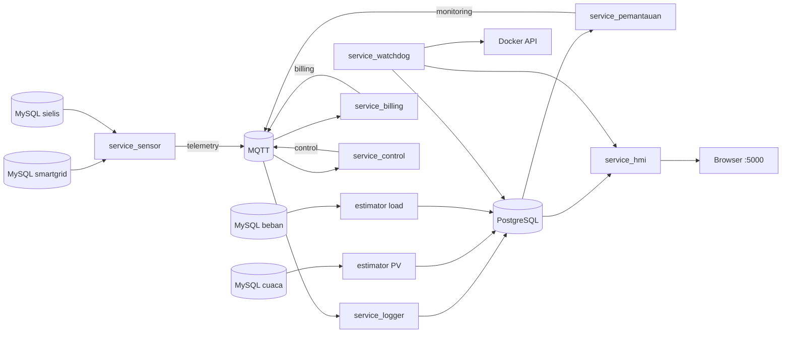

# Arsitektur

## Bentuk sistem

Repo ini memakai arsitektur microservice. Folder terpisah bukan aplikasi yang harus dilebur menjadi satu proses; setiap folder memiliki dependensi dan siklus hidup berbeda. Kesatuannya berada di `docker-compose.yml`, jaringan `microgrid_net`, broker MQTT, PostgreSQL, serta kontrak payload yang dipakai bersama.

## Alur utama

1. `service_sensor/kirim.py` membaca tiga kelompok data dari MySQL: hybrid inverter, PV inverter, dan meter beban.
2. Sensor memastikan timestamp sumber fresh dan sinkron, lalu menerbitkan payload dengan `telemetry_id` deterministik setiap 60 detik.
3. Billing dan control mengonsumsi telemetri lalu menerbitkan hasil masing-masing.
4. Logger mengonsumsi telemetri, billing, control, dan monitoring, kemudian menulisnya ke PostgreSQL.
5. Validator membaca data sensor terbaru dari PostgreSQL dan menerbitkan alert kualitas data.
6. Estimator PV dan load menulis prediksi langsung ke PostgreSQL pada jadwal harian.
7. Flask menyediakan dashboard dan API dengan membaca data PostgreSQL.
8. Watchdog melaporkan freshness tabel dan hanya me-restart HMI ketika readiness gagal, dengan cooldown dan restart budget.

## Batas sistem

Komponen yang disediakan Compose:

- Satu broker MQTT pada `mqtt_broker:1883`.
- Satu PostgreSQL pada `postgres:5432`.
- Sembilan service aplikasi Python.
- Satu jaringan bridge `microgrid_net`.
- Volume persisten `postgres_data`.

Komponen eksternal yang tidak disediakan repo:

- MySQL `smartgrid`, `smartgrid_cas`, dan `sielis`.
- Perangkat/inverter yang mengisi database sumber.
- Internet browser untuk library UI dari CDN.

## Keputusan desain penting

### MQTT untuk event, PostgreSQL untuk pembacaan HMI

MQTT menghubungkan producer dan consumer secara longgar. HMI tidak berlangganan langsung ke MQTT; HMI membaca state terbaru dan histori dari PostgreSQL. Karena itu logger adalah penghubung penting antara pipeline real-time dan dashboard.

### Estimator menulis langsung ke PostgreSQL

Estimator tidak bergantung pada MQTT. Integrasi HMI terhadap hasil estimasi terjadi langsung melalui tabel `pv_estimasi` dan `load_estimasi` dengan batch upsert.

### State billing berada di memori

Akumulator tampilan di `service_billing/billing_engine.py` tetap berada di memori, tetapi setiap pesan juga menyimpan energi, biaya, dan CO2 interval ke PostgreSQL. Ringkasan periode dan total harian HMI memakai nilai interval sehingga tidak bergantung pada umur proses billing.
